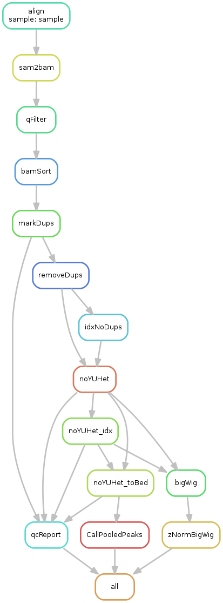

# McKayLab FAIRE Pipeline version 3.0
## Authors: Spencer Nystrom, Chris Uyehara, Jayashree Kumar
## Date: 2016-01-12

### Description
**Pipeline Steps:**



**Outputs**:

	- Raw bamfile for each sample
	- Bam & bed files filtered for MAPQ > 5, sorted, removed PCR duplicates, removed reads mapping to chrY, U, or heterochromatic regions for each sample and pooled samples
	- Bigwigs for each sample and all samples pooled
	- zNormalized Bigwigs for each sample and pooled samples
	- pooled macs2 peak calls & a bedfile of peaks sorted descending by qValue with only chr, start, end, name, qValue
	- Will **NOT** pool peaks or create pooled files if there are no files to pool.

### Usage:

Each experiment should have its own directory with 1 fastq.gz file per biological replicate. Technical replicates should be pooled prior to running the pipeline. The name of the experiment directory will
be used to name pooled files (pooled bigwigs, peak calls, etc.). For example, a directory named 'OR-24APF-Wing-FAIRE' containing two fastq.gz files will produce a Pooled Bigwig named:
'BigWigs/OR-24APF-Wing-FAIRE_2Reps_POOLED_q5_sorted_dupsRemoved_noYUHet_normalizedToRPGC.bw', where 'OR-24APF-Wing-FAIRE' is detected from the experiment directory name, and '2Reps' 
is detected by counting the number of fastq files in the directory.


**NOTE:** Do not use spaces in file or directory names

The pipeline itself can be stored anywhere, however, by convention it should be stored in `src/` as a subdirectory of the project directory.

**Example Directory Structure**
```{bash}
Project_Dir
├── <genotype>-<time>-<tissue>-FAIRE
│   ├── <sample>_rep1.fastq.gz
│   └── <sample>_rep2.fastq.gz
└── src
    └──	faire-pipeline/
		├── clusterConfig
		│   └── slurmConfig.json
		├── docs
		│   └── dag.png
		├── ReadMe.md
		├── slurmSubmission.sh
		├── Snakefile
		├── zNorm.r
		└── z_norm_v2.py
  
```
### General Workflow:
1. Make project directory
1. Clone repository into src/
1. change `GenomeAssembly` if necessary (Currently only supports dm3, so this is unnecessary)
1. Create directories for each experiment 
	* Copy or symlink fastq.gz files (pool technical replicate fastq.gz and do read trimming first if necessary)
1. Inside each experiment directory run: ` sh ../src/faire-pipeline/slurmSubmission.sh ` 
	- Job progress will be reported by snakemake. Progress can further be monitored by running `watch -n1 sacct -S now` in a separate terminal.
	- To manage job submission in background run ` nohup sh ../src/faire-pipeline/slurmSubmission.sh & disown`
	- To run on multiple directories (with 'FAIRE' in the names, in this example) at once, run: `for d in *FAIRE*; do cd $d ; nohup sh ../src/faire-pipeline/slurmSubmission.sh & disown ; cd .. ; done`
		- Snakemake output will be appended to nohup.out in each directory.
		- If you choose to run the pipeline this way, it is highly recommended you monitor job progress with `watch -n1 sacct -S <time you ran the pipeline>` to check for FAILED jobs.

**NOTE**: If not using submission script, you *must* provide the path to the snakefile as the first call to snakemake:
`snakemake --snakefile <path/to/Snakefile>`

### Requirements:
	- pysam (python2.7)
	- pyBigWig (python2.7)
	- snakemake (python3)
	- multiqc (python3)
	- rtracklayer (r, bioconductor)	
**Note**: 

Run `InstallPythonModules_longleaf.sh` to install required packages

rtracklayer is preinstalled on longleaf


# ToDo:
	- Call range of peaks for QC analysis
		- Ideally, perhaps another pipeline for determining optimal number of peaks
			as determined by the sample with lowest ideal peak # in a set of peaks that will be compared
	- Add support for dm6
	- symlink to .faire-pipeline could cause problems if force rerunning pipeline and want to force recreation. Need to think of a robust solution to this.
